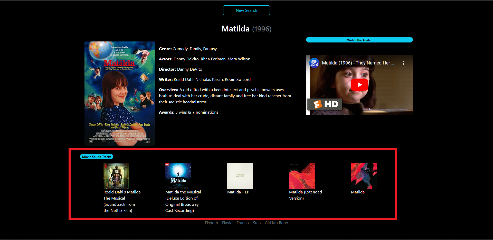
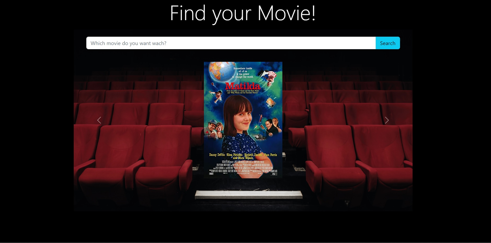

# Find your movie!

<!-- PROJECT SHIELDS -->
<!--
*** I'm using markdown "reference style" links for readability.
*** Reference links are enclosed in brackets [ ] instead of parentheses ( ).
*** See the bottom of this document for the declaration of the reference variables
*** for contributors-url, forks-url, etc. This is an optional, concise syntax you may use.
*** https://www.markdownguide.org/basic-syntax/#reference-style-links
-->
[![Contributors][contributors-shield]][contributors-url]
[![Forks][forks-shield]][forks-url]
[![Stargazers][stars-shield]][stars-url]
[![Issues][issues-shield]][issues-url]
[![MIT License][license-shield]][license-url]


<!-- PROJECT LOGO -->
<br />
<div align="center">
  <a href="https://github.com/fl4viooliveira/find-your-movie">
	
  </a>

  <p align="center">
    Find your movie!
    <br />
    <a href="https://github.com/fl4viooliveira/find-your-movie"><strong>Explore the docs »</strong></a>
    <br />
    <br />
    <a href="https://fl4viooliveira.github.io/find-your-movie/">View Demo</a>
    ·
    <a href="https://github.com/fl4viooliveira/find-your-movie/issues">Report Bug</a>
    ·
    <a href="https://github.com/fl4viooliveira/find-your-movie/issues">Request Feature</a>
  </p>
</div>


<!-- TABLE OF CONTENTS -->
<details>
  <summary>Table of Contents</summary>
  <ol>
    <li>
      <a href="#about-the-project">About The Project</a>
      <ul>
        <li><a href="#built-with">Built With</a></li>
      </ul>
    </li>
    <li>
      <a href="#getting-started">Getting Started</a>
      <ul>
        <li><a href="#prerequisites">Prerequisites</a></li>
        <li><a href="#installation">Installation</a></li>
      </ul>
    </li>
    <li><a href="#usage">Usage</a></li>
    <li><a href="#roadmap">Roadmap</a></li>
    <li><a href="#contributing">Contributing</a></li>
    <li><a href="#license">License</a></li>
    <li><a href="#contact">Contact</a></li>
    <li><a href="#acknowledgments">Acknowledgments</a></li>
  </ol>
</details>


<!-- ABOUT THE PROJECT -->
## About The Project


### Built With

* [![Bootstrap][Bootstrap.com]][Bootstrap-url]
* [![JQuery][JQuery.com]][JQuery-url]

<p align="right">(<a href="#readme-top">back to top</a>)</p>

### Description

A website application that provides information about movies based on user input, including a trailer, and the top ITunes albums for that movie. The application uses three different APIs:

  <ol>
    <li>
    Open Movie Database API (OMDb API) for retrieving movie information.</li>
    <li>
    YouTube API for delivering movie trailers.</li>
    <li>
    iTunes API for delivering movie soundtracks.</li>
  </ol>
<!-- GETTING STARTED -->

## Getting Started

## Usage
  <ul>  
    <li>
    The opening page will display a simple search bar for the user to input the movie they want to search. 
	</li>
    <li>
    Once the user searches for a movie the page will display:
	   <ul>
		<li> the information for that movie
		</li>
		<li> the trailer
		</li>
		<li> the top 5 albums from ITunes 
	    	</li>
	    </ul>
	</li>
    <li>
    Once the user clickes the "new search" button, the webpage will disply the past searched movies in the carousel below the search bar
	</li>
	<li>With each new search, the past movie information will be removed and the new movie information shown. The past movie will then be added to the past movies carousel.</li>
    <li> If the user inputs a string which does not correspond with a movie, then the below warning will appear. 
	
	</li>
  </ul>

<p align="right">(<a href="#readme-top">back to top</a>)</p>


### Installation

_To install, on the terminal type:_
   ```sh
   git clone git@github.com:fl4viooliveira/find-your-movie.git
   ```
<p align="right">(<a href="#readme-top">back to top</a>)</p>


<!-- CONTRIBUTING -->
## Contributing

Contributions are what make the open source community such an amazing place to learn, inspire, and create. Any contributions you make are **greatly appreciated**.

If you have a suggestion that would make this better, please fork the repo and create a pull request. You can also simply open an issue with the tag "enhancement".
Don't forget to give the project a star! Thanks again!

1. Fork the Project
2. Create your Feature Branch (`git checkout -b feature/AmazingFeature`)
3. Commit your Changes (`git commit -m 'Add some AmazingFeature'`)
4. Push to the Branch (`git push origin feature/AmazingFeature`)
5. Open a Pull Request

<p align="right">(<a href="#readme-top">back to top</a>)</p>


<!-- LICENSE -->
## License

Distributed under the MIT License. See `LICENSE.txt` for more information.

<p align="right">(<a href="#readme-top">back to top</a>)</p>


<!-- CONTACT -->
## Contact


<p align="right">(<a href="#readme-top">back to top</a>)</p>
https://github.com/fl4viooliveira
https://github.com/Moobell1212
https://github.com/francostroff
https://github.com/Mister-Stan


Project Link: https://github.com/fl4viooliveira/find-your-movie


<!-- ACKNOWLEDGMENTS -->
## Acknowledgments

* [Img Shields](https://shields.io)
* [GitHub Pages](https://pages.github.com)
* [Font Awesome](https://fontawesome.com)

<p align="right">(<a href="#readme-top">back to top</a>)</p>


<!-- MARKDOWN LINKS & IMAGES -->
<!-- https://www.markdownguide.org/basic-syntax/#reference-style-links -->
[contributors-shield]: https://img.shields.io/github/contributors/fl4viooliveira/find-your-movie.svg?style=for-the-badge
[contributors-url]: https://github.com/fl4viooliveira/find-your-movie/graphs/contributors
[forks-shield]: https://img.shields.io/github/forks/fl4viooliveira/find-your-movie.svg?style=for-the-badge
[forks-url]: https://github.com/fl4viooliveira/Best-README-Template/network/members
[stars-shield]: https://img.shields.io/github/stars/fl4viooliveira/find-your-movie.svg?style=for-the-badge
[stars-url]: https://github.com/fl4viooliveira/find-your-movie/stargazers
[issues-shield]: https://img.shields.io/github/issues/fl4viooliveira/find-your-movie.svg?style=for-the-badge
[issues-url]: https://github.com/fl4viooliveira/find-your-movie/issues
[license-shield]: https://img.shields.io/github/license/fl4viooliveira/find-your-movie.svg?style=for-the-badge
[license-url]: https://github.com/fl4viooliveira/find-your-movie/blob/master/LICENSE.txt
[linkedin-shield]: https://img.shields.io/badge/-LinkedIn-black.svg?style=for-the-badge&logo=linkedin&colorB=555
[product-screenshot]: images/screenshot.png
[Next.js]: https://img.shields.io/badge/next.js-000000?style=for-the-badge&logo=nextdotjs&logoColor=white
[Next-url]: https://nextjs.org/
[React.js]: https://img.shields.io/badge/React-20232A?style=for-the-badge&logo=react&logoColor=61DAFB
[React-url]: https://reactjs.org/
[Vue.js]: https://img.shields.io/badge/Vue.js-35495E?style=for-the-badge&logo=vuedotjs&logoColor=4FC08D
[Vue-url]: https://vuejs.org/
[Angular.io]: https://img.shields.io/badge/Angular-DD0031?style=for-the-badge&logo=angular&logoColor=white
[Angular-url]: https://angular.io/
[Svelte.dev]: https://img.shields.io/badge/Svelte-4A4A55?style=for-the-badge&logo=svelte&logoColor=FF3E00
[Svelte-url]: https://svelte.dev/
[Laravel.com]: https://img.shields.io/badge/Laravel-FF2D20?style=for-the-badge&logo=laravel&logoColor=white
[Laravel-url]: https://laravel.com
[Bootstrap.com]: https://img.shields.io/badge/Bootstrap-563D7C?style=for-the-badge&logo=bootstrap&logoColor=white
[Bootstrap-url]: https://getbootstrap.com
[JQuery.com]: https://img.shields.io/badge/jQuery-0769AD?style=for-the-badge&logo=jquery&logoColor=white
[JQuery-url]: https://jquery.com 

